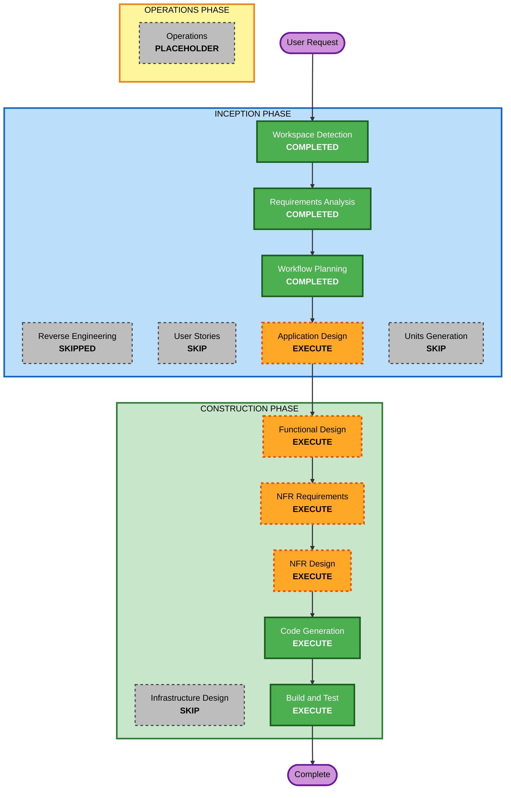

# 실행 계획 (Execution Plan)

**프로젝트**: Elasticsearch 데이터 추출 도구 (es_api)
**단계**: INCEPTION - Workflow Planning
**작성일**: 2026-09-09

---

## 1. 상세 분석 요약

### 변경 영향 평가 (Change Impact Assessment)

| 영역 | 해당 | 설명 |
|---|---|---|
| 사용자 대면 변경 | Yes | CLI 인터페이스 (개발자가 직접 사용) + 라이브러리 공개 API |
| 구조적 변경 | Yes | Greenfield — 패키지 구조를 새로 정의 |
| 데이터 모델 변경 | Yes | JSONL 스키마(ES 원본 보존), CSV 컬럼 매핑, 체크포인트 상태 파일 스키마 |
| API 변경 | No | 외부 API 없음. Elasticsearch는 **읽기 전용**으로만 사용 |
| NFR 영향 | Yes | 재시도, 스트리밍 메모리, 시크릿 관리, 클러스터 부하 |

### 리스크 평가 (Risk Assessment)

| 항목 | 판정 |
|---|---|
| **리스크 수준** | **Low** |
| 롤백 복잡도 | Easy — 신규 프로젝트, 기존 시스템 변경 없음 |
| 테스트 복잡도 | Moderate — ES 의존 부분은 모킹 필요, 날짜/변환 로직은 순수 함수로 테스트 가능 |

**Low로 판정한 근거**: Elasticsearch에 대해 **읽기 전용**이며, 기존 코드베이스가 없어 회귀 위험이 없고,
실패해도 파일을 지우고 다시 실행하면 되는 구조입니다.

**단 하나의 주의 항목 — 클러스터 부하**:
scroll API는 요청마다 검색 컨텍스트를 ES 서버 메모리에 유지합니다(제약 C-2).
하루 단위로 반복 실행하는 구조에서 `clear_scroll`을 누락하면 컨텍스트가 누적되어
**부하를 줄이려고 하루씩 쪼갠 목적(C-3)과 정반대의 결과**가 됩니다.
→ FR-3의 "청크 종료 시 반드시 scroll 컨텍스트 정리" 요구사항이 이 리스크의 유일한 방어선이며,
   Functional Design과 Code Generation 단계에서 이를 명시적으로 검증합니다.

### 작업 단위 (Units of Work)
**단일 단위**: `es-crawler` — Python 패키지 하나로 전체 기능을 담습니다.
분해가 필요한 다중 서비스/모듈 구조가 아니므로 Units Generation을 건너뜁니다.

---

## 2. 워크플로우 시각화



### 텍스트 대안 (Text Alternative)

```
INCEPTION PHASE
  Workspace Detection ....... COMPLETED
  Reverse Engineering ....... SKIPPED   (greenfield)
  Requirements Analysis ..... COMPLETED
  User Stories .............. SKIP      (개발자 도구, 단일 사용자 유형)
  Workflow Planning ......... COMPLETED
  Application Design ........ EXECUTE
  Units Generation .......... SKIP      (단일 패키지)

CONSTRUCTION PHASE
  Functional Design ......... EXECUTE
  NFR Requirements .......... EXECUTE
  NFR Design ................ EXECUTE
  Infrastructure Design ..... SKIP      (클라우드 리소스 없음)
  Code Generation ........... EXECUTE
  Build and Test ............ EXECUTE

OPERATIONS PHASE
  Operations ................ PLACEHOLDER
```

---

## 3. 실행할 단계 (Phases to Execute)

### 🔵 INCEPTION PHASE
- [x] Workspace Detection (COMPLETED)
- [x] Reverse Engineering (SKIPPED — greenfield, 기존 코드 없음)
- [x] Requirements Analysis (COMPLETED)
- [x] User Stories (SKIP)
  - **근거**: 개발자 도구이며 사용자 유형이 하나(본인)입니다. 사용자 대면 UI도, 여러 페르소나도,
    스토리로 명확해질 수 있는 요구사항 모호성도 없습니다. CLI 사용 방식은 이미 FR-8/FR-9에 확정되어
    있어 스토리가 추가로 밝혀낼 것이 없습니다.
- [x] Workflow Planning (COMPLETED)
- [ ] **Application Design — EXECUTE**
  - **근거**: Greenfield이므로 컴포넌트 경계를 새로 정의해야 합니다. 최소 6개 컴포넌트
    (Config, DateChunker, EsExtractor, JsonlWriter, CsvConverter, CheckpointStore)와 그 사이의
    의존 방향을 먼저 정해야 코드 생성이 일관됩니다. 특히 **추출 단계와 변환 단계가 분리 실행 가능**해야
    한다는 FR-5 요구가 인터페이스 설계에 직접 영향을 줍니다.
- [ ] **Units Generation — SKIP**
  - **근거**: 산출물이 Python 패키지 하나입니다. 분해할 다중 서비스·모듈이 없고, 병렬 개발할 단위도
    없습니다. 전체를 단일 단위 `es-crawler`로 다룹니다.

### 🟢 CONSTRUCTION PHASE (단위: `es-crawler`)
- [ ] **Functional Design — EXECUTE**
  - **근거**: 정확성이 미묘한 로직이 세 군데 있습니다.
    ① **날짜 분할** — 18:00 anchor + KST/UTC 변환 + 반개구간 경계. 여기가 틀리면 데이터가
      조용히 누락되거나 중복되고, 로그만 봐서는 알 수 없습니다.
    ② **체크포인트 상태 전이** — 대기/완료/실패, 재개 시 어느 청크부터 다시 도는가.
    ③ **JSONL→CSV 컬럼 매핑** — 점 표기법 경로 해석, 누락 필드 처리, 헤더 리네이밍.
    또한 PBT-01(속성 식별)이 이 단계에서 수행됩니다.
- [ ] **NFR Requirements — EXECUTE**
  - **근거**: 기술 스택 확정(Python 버전, `elasticsearch` 버전 핀, pytest/hypothesis)이 필요합니다.
    **PBT-09(프레임워크 선정)는 Partial 모드에서 차단성 규칙이며 이 단계에서 강제됩니다.**
    재시도 파라미터(`max_retries`, 백오프)와 배치 크기 기본값도 여기서 정합니다.
- [ ] **NFR Design — EXECUTE** (간결하게)
  - **근거**: NFR을 실제 코드 구조로 옮기는 패턴을 정합니다 — scroll 컨텍스트를 컨텍스트 매니저로
    보장하는 방식, 체크포인트 파일의 원자적 쓰기(중단 시 손상 방지), 스트리밍 제너레이터 경계,
    `.env` 로딩과 로그 마스킹. 위 "클러스터 부하" 리스크의 방어선이 여기서 구체화됩니다.
- [ ] **Infrastructure Design — SKIP**
  - **근거**: 클라우드 리소스, 배포 아키텍처, 네트워킹 구성이 없습니다. 로컬 실행 + 외부 스케줄러
    (cron)이며 스케줄러 자체는 범위 밖(Out of Scope)입니다.
- [ ] **Code Generation — EXECUTE** (ALWAYS)
  - **근거**: 구현 계획 수립 후 코드·테스트 생성.
- [ ] **Build and Test — EXECUTE** (ALWAYS)
  - **근거**: 빌드/테스트 실행 지침 작성 및 검증.

### 🟡 OPERATIONS PHASE
- [ ] Operations — PLACEHOLDER

---

## 4. 예상 일정 (Estimated Timeline)

| 항목 | 값 |
|---|---|
| 남은 실행 단계 | **6개** (Application Design, Functional Design, NFR Requirements, NFR Design, Code Generation, Build and Test) |
| 건너뛰는 단계 | **4개** (Reverse Engineering, User Stories, Units Generation, Infrastructure Design) |
| 승인 게이트 | 6회 (각 단계 완료 시) |

---

## 5. 성공 기준 (Success Criteria)

### 주요 목표
지정한 기간의 Elasticsearch 문서를 하루 단위로 빠짐없이·중복 없이 추출해 JSONL로 보존하고,
설정된 컬럼만 CSV로 변환하며, 중단 후 재실행하면 남은 부분만 이어서 처리하는 Python 패키지.

### 핵심 산출물
- Python 패키지 (`import` 가능) + 얇은 CLI 진입점
- 설정 파일 스키마 + `.env.example`
- pytest 예제 기반 테스트 + hypothesis 속성 기반 테스트
- 빌드/테스트 실행 지침

### 품질 게이트
- [ ] 5일 범위 요청이 5개 청크로 분할되고, 청크 경계에 **누락도 중복도 없음** (속성 테스트로 검증)
- [ ] 모든 청크의 시간 폭이 24시간 **이하** (속성 테스트로 검증)
- [ ] 10,000건 초과 결과가 scroll로 완전히 페이징됨
- [ ] 정상 종료·예외 발생 **양쪽 모두**에서 scroll 컨텍스트가 정리됨
- [ ] 중단 후 재실행 시 완료된 청크를 건너뛰고, 같은 날짜 재실행 결과가 동일함(idempotent)
- [ ] JSONL 직렬화 왕복이 원본과 일치 (PBT-02)
- [ ] CSV 출력 행 수 = 입력 문서 수, 컬럼 = 설정된 목록 (PBT-03)
- [ ] API Key가 로그에 남지 않고 `.env`가 버전 관리에서 제외됨
- [ ] 공개 함수·클래스에 타입 힌트 존재

---

## 6. 확장 규칙 준수 요약 (Extension Compliance)

| 확장 | 상태 | 이 단계 적용 |
|---|---|---|
| Security Baseline | 비활성 (옵트아웃) | N/A — 규칙 파일 미로드 |
| Resiliency Baseline | 비활성 (옵트아웃) | N/A — 규칙 파일 미로드 |
| Property-Based Testing | 활성 (Partial) | Workflow Planning은 PBT 강제 대상 단계가 아님 (N/A). 단, PBT-01은 Functional Design, PBT-09는 NFR Requirements 단계에 배정되도록 계획에 반영함 |

**차단성 발견 사항(Blocking findings): 없음.**
